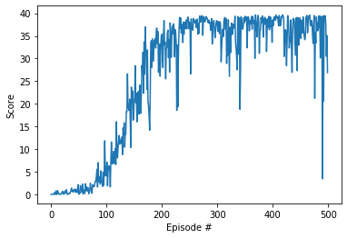

# Deep Reinforcement Learning Nanodegree
# *DRLND-Continuous-Control*

## Report on the Implementation of the (chosen) DDPG-Agent

### Implementation

The environment and the DDPG-agent are all implemented inside `Continuous_Control.ipynb`. As chapter 1 - 3 were given from the project framework, chapter 4 contains all the implementation necessary to define, to train, and to run the DDPG-agent. It consists of the following parts:

* 4.0 Utils
* 4.1 Model
* 4.2 Agent
* 4.3 Training
* 4.4 Run the Agent

The implementation and algorithms will be described in the following. Afterwards, results of the implementation and an outlook will be presented.

#### Model (Definition)

The model section consists of a generic function `hidden_init` to initialize the weights of the models, an **actor** and a **critic** class. Each of the two classes can be used to define local and target networks resulting in four networks in total.
    
The **actor** network has three fully-connected layers where the first two layers have ReLU-activation functions and the third has a tanh-activation function. Each output of the ReLU-layers is batch-normalized. The input dimension of the network equals the `state_size` and the output dimension is the `action_size`. The dimensions of the two first hidden layers can be defined by `FC1_SIZE` and `FC2_SIZE` in the implementation block of chapter 4.2. The weights of the fully-connected layers are initialized via the uniform distribution.
    
The **critic** network is build by three fully-connected layers. The input of the first layer is of `state_size`. The first layer is of dimension `FC1_SIZE` and is followed by a ReLU-activation function and batch-normalization layer. The second layer gets as input the action vector of size `action_size` plus the output of the batch-normalization layer of the first layer. Both inputs are necessary to calculate the right action-state value. The second layer has `FC2_SIZE` neurons, a ReLU-activation function followed by the third layer which matches the input to one output with its linear activation function.

#### Agent (Definition)

In the agent section, the general settings, the **Agent** and **ReplayBuffer** classes are given.

The class **Agent** initializes four models (actor and critic, each gets one for the local development and one for the fixed target). The class uses Adam optimization for both local networks and to be defined parameters learning-rate `LR`, decay-rate `GAMMA`, and target-update rate `TAU`.    
The class **Agent** consists of the functions `step`, `act`, `learn`, and `soft_update`. The `soft_update` function updates the target parameters by itself and the local parameters by a `TAU`-defined ratio. The `learn` function calculates the mean-square error loss for the critic and the actor. The critic loss is determined by the expected Q-value and current one. The actor is optimized by the policy (action-state value) loss derived from the local critic network which gets the local actor output as input. The function `act` determines the epsilon-greedy based action by passing the state through the local actor network and by choosing the result or randomly another action with the help of eps(silon). Finally, the `step` function stores the (state, action, reward, next_state, done)-tuple in the **ReplayBuffer** and controls the learning in dependence of `UPDATE_EVERY` (call of function `learn`).

The **ReplayBuffer** is implemented to store the (state, action, reward, next_state, done)-tuple. The length of the buffer is defined by `BUFFER_SIZE`. The class owns the functions `add` to add a tuple to the memory and `sample` to create a batch of size `BATCH_SIZE` with elements of the replay memory.    

#### Training (the Agent)

The function `ddpg` trains the agent. For `n_episodes`, it determines, as long as the episode holds, the action by calling `Agent.act(states, eps)`, gets the `env_info` from the environment containing the next_state, reward, and done and performs `agent.step()`.       
Before the function is called, an Agent has to be defined.

#### Run the Agent

In this block, the saved model parameters are loaded into the agent and the agent simulates one episode delivering a score as a result.

### Result

The DDPG-model has been defined by the `state_size=33`, `action_size=4`, and number of neurons in the first and second hidden layer of 128 (`FC1_SIZE=128`, `FC2_SIZE=128`).    
The replay buffer consists of `BUFFER_SIZE=10000` buffers and generates samples of size `BATCH_SIZE=64`.    
The learning-rate is `LR=5e-4`, update relationship is `TAU=1e-3`, decay rate is `GAMMA=0.99`, and the target parameter are updated every fourth time step (`UPDATE_EVERY=4`).

With these settings, the average score of above 30.0 could be hold for more than 100 episodes!
The model needed approx. 200 episodes to meet the requirements.

### Outlook

According to Yan Duan et al., "Benchmarking Deep Reinforcement Learning for Continuous Control", the TNPG and TRPO algorithms seem to outperform all the other algorithms most of the time. It might be worthwhile to test the algorithms on the Reacher task. 
